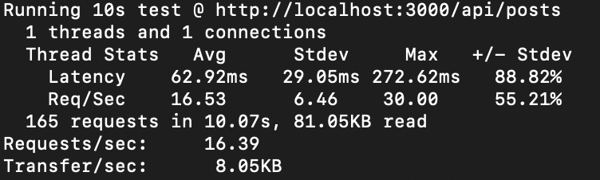
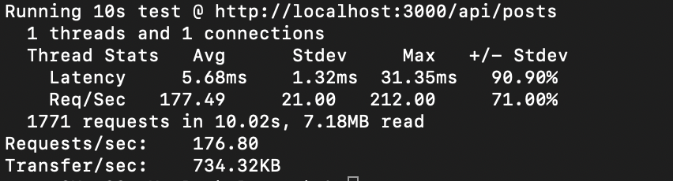

# Imagegram
## Prerequisites
Make sure you have installed all of the following prerequisites on your development machine:
* Node.js - [Download & Install Node.js](https://nodejs.org/en/download/) and the npm package manager. If you encounter any problems, you can also use this [GitHub Gist](https://gist.github.com/isaacs/579814) to install Node.js.
## Optional
* Docker - [Download & Install Docker](https://www.docker.com/products/docker-desktop)
* Docker Compose - [Download & Install Docker Compose](https://docs.docker.com/compose/install/)

## Design
* Nestjs framework (Nodejs) to leverage modern features of javascript
* Mysql 8.0 as a relational database
* Redis for caching (session, realtime data, ...)
* Docker compose for easy development, running mysql and redis on docker

## Installation

```bash
$ npm install
```

## Configuration
Creating .env file in env folder by copying from .env.example or export environment variables (for more secure)
```bash
$ cp .env.example .env
```
- Add `REDIS_HOST` key-value pairs to .env file
- Add `REDIS_PORT` key-value pairs to .env file
- Add `TYPEORM_CONNECTION` key-value pairs to .env file
- Add `TYPEORM_HOST` key-value pairs to .env file
- Add `TYPEORM_PORT` key-value pairs to .env file
- Add `TYPEORM_USERNAME` key-value pairs to .env file
- Add `TYPEORM_PASSWORD` key-value pairs to .env file
- Add `TYPEORM_DATABASE` key-value pairs to .env file
- Add `TYPEORM_SYNCHRONIZE` key-value pairs to .env file
- Add `TYPEORM_SYNCHRONIZE` key-value pairs to .env file
- Add `TYPEORM_MIGRATIONS_RUN` key-value pairs to .env file
- Add `TYPEORM_ENTITIES` key-value pairs to .env file
- Add `TYPEORM_MIGRATIONS` key-value pairs to .env file
- Add `TYPEORM_LOGGING` key-value pairs to .env file
- Add `TYPEORM_MIGRATIONS_DIR` key-value pairs to .env file

## First time running
```bash
# mannualy migrate database schema
$ npm run migrate:up

$ npm run start
```

## Running the app

```bash
# development
$ npm run start

# watch mode
$ npm run start:dev

# production mode
$ npm run start:prod
```

## Test

```bash
# unit tests
$ npm run test

# e2e tests
$ npm run test:e2e

# test coverage
$ npm run test:cov
```

## Linting

```bash
$ npm run lint
```

## Apis

#### Create account

* Method: `POST`
* Url: `http://localhost:3000/api/accounts`
* Path: `/api/accounts`
* Params of body:

| Param        | Type           | Required | Default | Note  |
| ------------- |-------------| ---- | ---| -----|
| name     | string | true | | |

* Using curl:
```
curl --location --request POST 'localhost:3000/api/accounts' \
--header 'Content-Type: application/json' \
--data-raw '{
    "name": "jason"
}'
```
* Return:
```
{
    "code": 200,
    "message": "Success",
    "data": {
        "name": "jason",
        "id": "16e6e9fb-4736-413c-99aa-d4799abd41af"
    }
}
``` 
---

#### Create post

* Method: `POST`
* Url: `http://localhost:3000/api/posts`
* Path: `/api/posts`
* Params of body (must be multipart/form-data):

| Param        | Type           | Required | Default | Note  |
| ------------- |-------------| ---- | ---| -----|
| caption     | string | true | | |
| image     | file | true | | |

* Using curl (must change image path to real path):
```
curl --location --request POST 'localhost:3000/api/posts' \
--header 'X-Account-Id: 16e6e9fb-4736-413c-99aa-d4799abd41af' \
--form 'caption="post 1633876532"' \
--form 'image=@"/path/to/image.png"'
```
* Return:
```
{
    "code": 200,
    "message": "Success",
    "data": {
        "caption": "post 1633875950",
        "image": "70e6e826-8593-4296-be90-f75114a83cd0.jpg",
        "creator": {
            "name": "jason",
            "id": "16e6e9fb-4736-413c-99aa-d4799abd41af"
        },
        "id": "b7a72c79-23e7-4fb5-ba1c-124023897bce",
        "createdAt": "2021-10-10T07:25:50.000Z"
    }
}
``` 
----

#### Create comment

* Method: `POST`
* Url: `http://localhost:3000/api/posts/:id/comments`
* Path: `/api/posts/:id/comments`
* Route param `id`, id of post
* Params of body:

| Param        | Type           | Required | Default | Note  |
| ------------- |-------------| ---- | ---| -----|
| content     | string | true | | |
* Using curl:
```
curl --location --request POST 'localhost:3000/api/posts/b7a72c79-23e7-4fb5-ba1c-124023897bce/comments' \
--header 'X-Account-Id: 16e6e9fb-4736-413c-99aa-d4799abd41af' \
--header 'Content-Type: application/json' \
--data-raw '{
    "content": "comment 1633876436"
}'
```
* Return:
```
{
    "code": 200,
    "message": "Success",
    "data": {
        "content": "comment 1633876155",
        "postId": "b7a72c79-23e7-4fb5-ba1c-124023897bce",
        "creator": {
            "name": "jason",
            "id": "16e6e9fb-4736-413c-99aa-d4799abd41af"
        },
        "creatorId": "16e6e9fb-4736-413c-99aa-d4799abd41af",
        "id": "135d1bb7-d1c9-4ef6-9a7f-ea102610988f",
        "createdAt": "2021-10-10T07:29:15.000Z"
    }
}
``` 
----

#### Create comment

* Method: `GET`
* Url: `http://localhost:3000/api/posts`
* Path: `/api/posts`
* Params of request query:

| Param        | Type           | Required | Default | Note  |
| ------------- |-------------| ---- | ---| -----|
| cursor     | string | false | | cursor-based pagination contains information about comment's count of post and last post id received |
* Using curl:
```
curl --location --request GET 'localhost:3000/api/posts?cursor=eyJsYXN0SWQiOiJmZjM3MDIwYi01NDBjLTRhMzctODE3Ny1iMzQ3ZmEwN2Y0ZTciLCJjb3VudCI6NH0' \
--header 'X-Account-Id: 16e6e9fb-4736-413c-99aa-d4799abd41af'
```
* Return:
```
{
    "code": 200,
    "message": "Success",
    "data": [
        {
            "id": "ff0b7bf8-fcdf-455b-a12a-3016541effb9",
            "caption": "caption 1633875040962",
            "image": "af6e70f4-6cbe-4931-841b-f263b407f235.jpg",
            "count": 4,
            "createdAt": "2021-10-10T07:10:44.000Z",
            "creator": {
                "id": "33955fcc-f09b-4c59-a7e9-cea7a472d1cc",
                "name": "account 1633874724410"
            },
            "comments": [
                "comment 1633875044181",
                "comment 1633875044202"
            ],
            "cursor": "eyJsYXN0SWQiOiJmZjBiN2JmOC1mY2RmLTQ1NWItYTEyYS0zMDE2NTQxZWZmYjkiLCJjb3VudCI6NH0"
        },
        {
            "id": "fe47b7b3-0653-45df-9fef-a6327a15b9db",
            "caption": "caption 1633875014529",
            "image": "80c5c134-7630-4524-8f86-650c22a959cc.jpg",
            "count": 4,
            "createdAt": "2021-10-10T07:10:17.000Z",
            "creator": {
                "id": "33955fcc-f09b-4c59-a7e9-cea7a472d1cc",
                "name": "account 1633874724410"
            },
            "comments": [
                "comment 1633875017703",
                "comment 1633875017724"
            ],
            "cursor": "eyJsYXN0SWQiOiJmZTQ3YjdiMy0wNjUzLTQ1ZGYtOWZlZi1hNjMyN2ExNWI5ZGIiLCJjb3VudCI6NH0"
        }
    ]
}
``` 
----

## Test benchmark
Using [wrk](https://github.com/wg/wrk) tool for load test. Using local medium machine so the result is not same as the result when deploying in the cloud. But we can have rough overview about the result.
* Create post

* List posts

## License

Nest is [MIT licensed](LICENSE).
